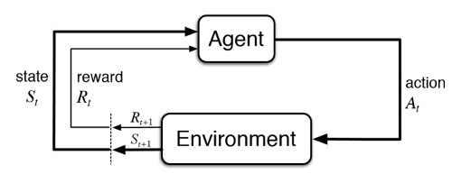
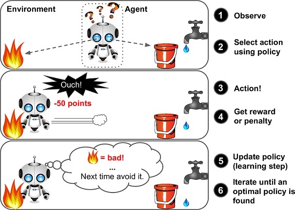
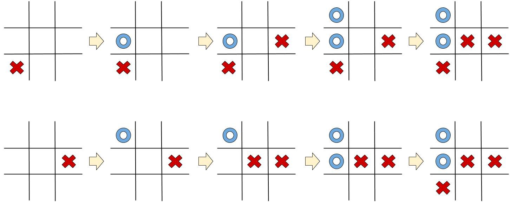
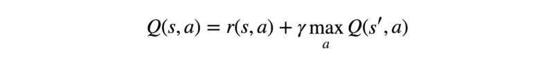
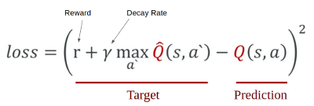
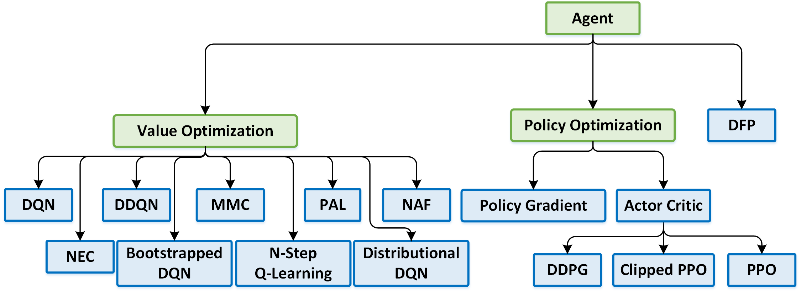

Reinforcement Learning: Introduction
====================================

This document explains the main concepts to understand the implementation of the algorithms used in this repository. It is focused only on the techniques used here, but there are a lot of other algorithms and methodologies available to try in this or another project.

### Definitions

Reinforcement Learning is a type of machine learning that allows you to create AI agents that learn from the environment by interacting with it. Just like how we learn to ride a bicycle, this kind of AI learns by trial and error. The picture above shows the basic diagram of a RL program interacting with the environment. The agent transitions between different scenarios of the environment, referred to as **states**, by performing **actions**. Actions, in return, yield **rewards**, which could be positive, negative or zero. Hence, we reinforce the agent to perform certain actions by providing it with positive rewards, and to stray away from others by providing negative rewards. This is how an Agent learns to develop a policy. The picture below shows a more representative example of this learning process commented.

Therefore, these are the main concepts that you are going to manage on a RL program:

- **Agent:** The problem solver, can perform some actions.
- **Environment:** An agent resides here. An environment provides responses to an agent based on the actions it performs.
- **Reward:** When an agent performs an action in an environment, there is an associated reward; rewards can be positive, negative(punishment) or zero.
- **State:** An agent’s action may cause it to enter a state which is a snapshot of the environment.
- **Policy:** Defines an agent’s behavior, can answer questions like what action should be performed in this state?
- **Value:** Tracks the long-term impact of the action. Provides a portion of reward to intermediate states that led to a final positive state.

### Markov Decision Processes

Each state the Agent is in is a direct consequence of the previous state and the chosen action. The previous state is also a direct consequence of the one that came before it, and so on till we reach the initial state. Each one of these steps, and their order, hold information about the current state — and therefore have direct effect on which action should the Agent choose next. But there’s an obvious problem here: the further we go, the more information the Agent needs to save and process at every given step it takes. This can easily reach the point where it is simply unfeasible to perform calculations.

To tackle this, we assume all states are **Markov States**; that is — we assume that any state depends solely on the state that came before it, and the transition from that state to the current one (the action performed and reward given). Let’s see an example — look at these two Tic Tac Toe games:

Both games reached the same state, but in different ways. Still, in both cases, the blue player must capture the top-right cell, or he will lose. All we needed in order to determine this was the last state, nothing else. It’s important to remember that when using the Markov assumption, data is being lost — in complex games such as Chess or Go, the order of the moves might have some implicit information on the opponent’s strategy or way of thought. Still, the Markov States assumption is fundamental when attempting to calculate long-term strategies.

### The Bellman Equation

Let’s go ahead and develop our first strategy. Consider the simplest case: assume we already know what is the expected reward for each action on each step. How will we choose an action in this case? Quite simply — we’ll choose the sequence of action that will eventually generate the highest reward. This cumulative reward we’ll receive is often referred to as Q Value, and we can formalize our strategy mathematically as:

The above equation states that the Q Value yielded from being at state s and selecting action a, is the immediate reward received, r(s,a), plus the highest Q Value possible from state s’ (which is the state we ended up in after taking action a from state s). We’ll receive the highest Q Value from s’ by choosing the action that maximizes the Q Value. We also introduce γ, usually called the discount factor, which controls the importance of long-term rewards versus the immediate one.

This powerful equation is known as the *Bellman Equation*, and will be very useful to us due to two important characteristics:

- While we still retain the Markov States assumptions, the recursive nature of the Bellman Equation allows rewards from future states to propagate to far-off past states.
- There’s no need to really know what are the true Q Values when we start off; Since its recursive, we can guess something, and it will eventually converge to the real values.

### Q-Learning

We now have a basic strategy — at any given state, perform the action that will eventually yield the highest cumulative reward. Algorithms like this are called greedy, for an obvious reason.

How would we implement this to solve real-life challenges? One way is drawing a table to store all possible state-action combinations, and use it to save Q Values. We can then update it using the Bellman Equation as an update rule:

Not done yet — our greedy algorithm has a serious problem: if you keep selecting the same best-actions, you’ll never try anything new, and you might miss a more rewarding approach just because you never tried it.

To solve this, we use an ε-greedy approach: for some 0 < ε < 1, we choose the greedy action (using our table) with a probability p = 1-ε, or a random action with probability p = ε. We thus give the Agent a chance to explore new opportunities.

### Deep Q-Learning

Deep Q-Learning allows us to combine Q-learning with general function approximators. Rather than updating the Q(s,a) value for each action, we just optimize a neural network Q(s,a) that approximates the value of that each state action pair to be close to the reward yielded plus a frozen estimate of the future state (conditional on the best future action).

In order to logically represent this intuition and train it, we need to express this as a formula that we can optimize on. The loss is just a value that indicates how far our prediction is from the actual target. For example, the prediction of the model could indicate that it sees more value in pushing the right button when in fact it can gain more reward by pushing the left button. We want to decrease this gap between the prediction and the target (loss). We will define our loss function, a Mean Squared Error (MSE), as follows:

We first carry out an action **a**, and observe the reward **r** and resulting new state **s**. Based on the result, we calculate the maximum target **Q** and then discount it so that the future reward is worth less than immediate reward (It is a same concept as interest rate for money. Immediate payment always worth more for same amount of money). Lastly, we add the current reward to the discounted future reward to get the target value. Subtracting our current prediction from the target gives the loss. Squaring this value allows us to punish the large loss value more and treat the negative values same as the positive values.

This algorithm works wonderfully and is the modern state of the art algorithm when appropriate. But in every update step, it iterates over all possible actions from the future state, which can be computationally expensive. In this case, we have few states so it stills works. However, always check the constraints of your environment to choose a methodology before start experiments.

### Experience Replay

One of the challenges for DQN is that neural network used in the algorithm tends to forget the previous experiences as it overwrites them with new experiences. So we need a list of previous experiences and observations to re-train the model with the previous experiences. We will call this array of experiences memory and use `remember()` function to append state, action, reward, and next state to the memory.

A method that trains the neural net with experiences in the memory is called `experience_replay()`. First, we sample a batch of some experiences from the memory. To make the agent perform well in long-term, we need to take into account not only the immediate rewards but also the future rewards we are going to get. In order to do this, we are going to use the ‘discount rate’ or ‘gamma’. This way the agent will learn to maximize the discounted future reward based on the given state.

### More algorithms

Q-Learning is just an example of the learning process in a reinforcement learning program, but you can [check](https://arxiv.org/abs/1708.05866) an look for many other interesting approaches!

----------------------------------------------------

## Resources

- Qrash Course: Reinforcement Learning 101 & Deep Q Networks in 10 Minutes: https://towardsdatascience.com/qrash-course-deep-q-networks-from-the-ground-up-1bbda41d3677
- Lessons Learned from Tic-Tac-Toe: Practical Reinforcement Learning Tips: https://towardsdatascience.com/lessons-learned-from-tic-tac-toe-practical-reinforcement-learning-tips-5cac654a45a8
- Reinforcement Learning: Train a bot to play tic-tac-toe: https://becominghuman.ai/reinforcement-learning-step-by-step-17cde7dbc56c
- Deep Q-Learning with Keras and Gym: https://keon.io/deep-q-learning/
